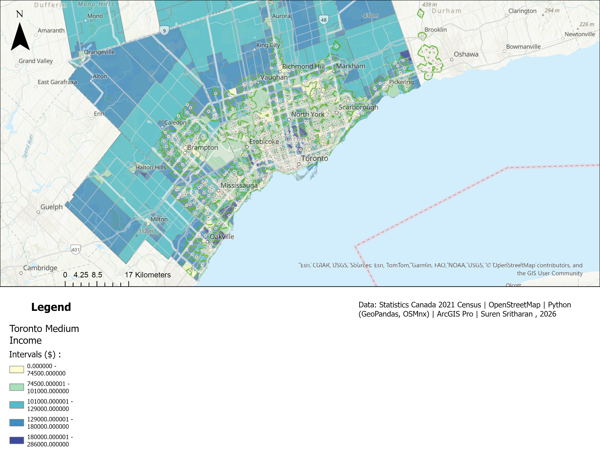

# gta-grocery-access-analysis
GTA grocery store access analysis using Python (OSMnx, GeoPandas) and ArcGIS Pro. Network analysis of 895 stores across 10 municipalities.

Tools: Python (GeoPandas, OSMnx, Pandas) · ArcGIS Pro · Statistics Canada · OpenStreetMap

## Key Finding
All 43 low income census tracts in the Greater Toronto Area fall within 1.6km walking distance of a grocery store, suggesting food insecurity in the GTA is driven by affordability, not physical access.

## Study Area
10 GTA municipalities: Toronto, Mississauga, Brampton, Markham, 
Vaughan, Richmond Hill, Pickering, Ajax, Whitby, Oakville

## Data Sources
- Statistics Canada 2021 Census — median household income by census tract
- OpenStreetMap via OSMnx — 895 grocery store locations
- Census tract boundary shapefile — Statistics Canada 2021

## Methodology
1. Downloaded median household income for 1,227 GTA census tracts
2. Flagged low income tracts below 60% of GTA median ($60,600)
3. Fetched 895 grocery store locations via OSMnx across 10 municipalities
4. Downloaded walkable street network (454,996 nodes) for full GTA
5. Calculated 1.6km walking catchment zones using network analysis
6. Overlaid low income tracts with catchment zones to identify food deserts

## Results
- GTA median household income: $101,000
- Low-income threshold: $60,600
- Low-income census tracts: 43 of 1,227
- Confirmed food deserts: 0

## Map

## Author
Suren Sritharan
